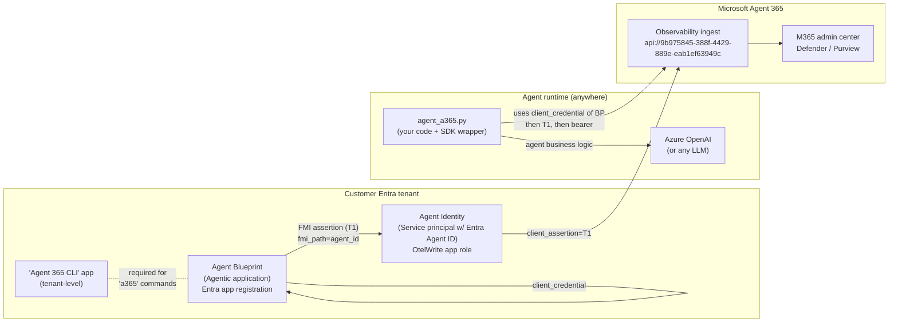
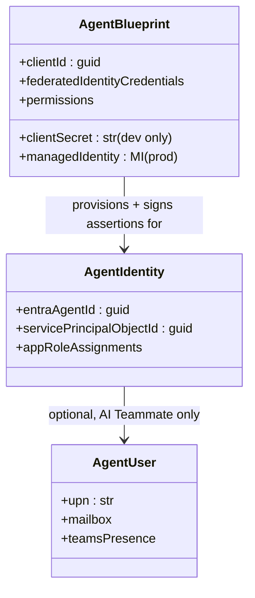
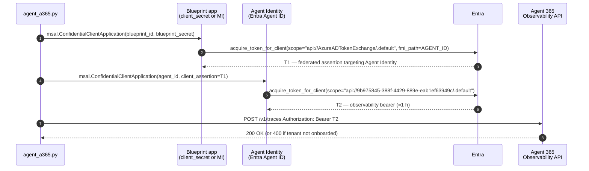
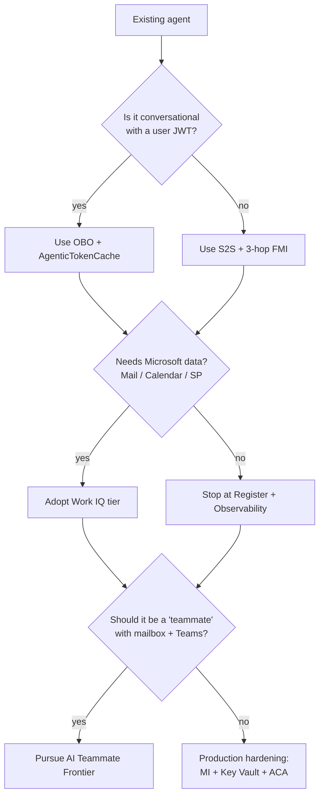

# Microsoft Agent 365 — Integration Guide

> **Purpose of this document.** This is the canonical, end-to-end guide for taking an **existing, already working** AI agent — built with any SDK, on any cloud — and integrating it into **Microsoft Agent 365**. It is written to serve three audiences in one pass:
>
> 1. **Engineers** who will execute the integration on the codebase (concrete commands, code patterns, gotchas).
> 2. **Architects / decision makers** who need to understand what Agent 365 *is*, what it *is not*, and what each integration tier buys you.
> 3. **A partner-facing presentation**: every section is structured so it can be lifted as-is into a slide.
>
> The reference case throughout this guide is the agent in [BasicAgent365/agent_basic.py](../agent_basic.py): a minimal, BYO ("bring your own"), single-tool, autonomous worker that talks to **Azure OpenAI Responses API** via the official `openai` SDK and Entra ID auth. The same patterns apply to any other agent stack (LangChain, Semantic Kernel, Microsoft Agent Framework, etc.).

---

## Table of contents

1. [Executive summary](#1-executive-summary)
2. [What Microsoft Agent 365 is — and what it is not](#2-what-microsoft-agent-365-is--and-what-it-is-not)
3. [Capability tiers: pick what you adopt](#3-capability-tiers-pick-what-you-adopt)
4. [High-level architecture](#4-high-level-architecture)
5. [Identity model: blueprint, identity, user](#5-identity-model-blueprint-identity-user)
6. [Authentication flows: OBO vs S2S](#6-authentication-flows-obo-vs-s2s)
7. [The 3-hop FMI/FIC token chain (mandatory for autonomous agents)](#7-the-3-hop-fmific-token-chain-mandatory-for-autonomous-agents)
8. [Prerequisites](#8-prerequisites)
9. [The Agent 365 DevTools CLI (`a365`)](#9-the-agent-365-devtools-cli-a365)
10. [SDK choice: the Microsoft OpenTelemetry Distro](#10-sdk-choice-the-microsoft-opentelemetry-distro)
11. [Observability semantics: the three mandatory scopes](#11-observability-semantics-the-three-mandatory-scopes)
12. [Step-by-step integration plan for the reference agent](#12-step-by-step-integration-plan-for-the-reference-agent)
13. [Code mapping: from `agent_basic.py` to `agent_a365.py`](#13-code-mapping-from-agent_basicpy-to-agent_a365py)
14. [Required Entra permissions and licenses](#14-required-entra-permissions-and-licenses)
15. [Verification, troubleshooting, and the gotchas we already paid for](#15-verification-troubleshooting-and-the-gotchas-we-already-paid-for)
16. [Security considerations](#16-security-considerations)
17. [Operational concerns (token lifetime, flushing, retries)](#17-operational-concerns-token-lifetime-flushing-retries)
18. [Roadmap: from PoC to production](#18-roadmap-from-poc-to-production)
19. [Glossary](#19-glossary)
20. [References](#20-references)

---

## 1. Executive summary

**Microsoft Agent 365 is a control plane for AI agents in Microsoft 365.** It does not replace the framework you used to build your agent. It adds, on top of any agent — regardless of stack or hosting — five things an enterprise demands:

1. **Identity** — every agent gets a first-class Entra identity, governed by Conditional Access, Purview, Defender for Cloud Apps.
2. **Observability** — every "invoke", every model call, every tool execution is captured as an OpenTelemetry span and ingested into the Microsoft 365 admin / security stack.
3. **Tooling (Work IQ)** — a curated catalogue of Microsoft-managed MCP servers giving the agent governed access to Mail, Calendar, Teams, SharePoint, OneDrive…
4. **Discoverability** — the agent shows up in the M365 admin center as a managed asset, with lifecycle (create / update / retire / cleanup).
5. **(Optional) AI Teammate persona** — the agent gets its own mailbox, Teams presence, manager, calendar. A teammate, not a bot. (Frontier preview only.)

The integration is **incremental**: a team can adopt only "Register + Observability" — which is the entire deliverable of this PoC — and stop there. Work IQ and AI Teammate are explicitly out of scope for this engagement.

**What we are demonstrating in this repository.** An existing minimal agent that uses Azure OpenAI Responses API and one local tool is augmented with the Agent 365 SDK so that every run produces governed audit telemetry in Microsoft 365 — **with no change to the agent's business logic**. The integration is purely *additive*: the agent keeps doing what it was doing.

---

## 2. What Microsoft Agent 365 is — and what it is not

| It IS | It is NOT |
|------|-----------|
| A **governance / control plane** for agents | A framework to *build* agents |
| **Stack-agnostic**: works with any SDK, any cloud | Limited to Microsoft tooling |
| An **OpenTelemetry-based** observability layer | A bespoke proprietary telemetry format |
| A **federated identity** model (Entra Agent IDs) | A managed runtime / hosting platform |
| A **curated MCP catalog** (Work IQ) | A free-for-all tool marketplace |
| **Additive** — you keep your existing code | A rewrite-everything migration |

Three product names that are commonly confused:

| Product | Purpose |
|---------|---------|
| **Microsoft Agent Framework** | An *SDK to build* agents (`client.responses.create`, orchestration, etc.). |
| **Microsoft 365 Agents SDK** | Hosting + Activity protocol for **conversational** agents (Teams / Copilot bots). |
| **Microsoft Agent 365** *(this guide)* | A governance layer that wraps agents built with *either* of the above (or anything else) and turns them into first-class M365 citizens. |

---

## 3. Capability tiers: pick what you adopt

Agent 365 is **incremental**. You opt into each tier separately. The reference case ("integrate an existing autonomous agent") only needs the first two.

| Tier | What it gives you | Effort | This PoC |
|------|-------------------|--------|----------|
| **1. Register** | The agent becomes a managed asset in the M365 admin center. Tenant admins can see / govern / retire it. | Low — one CLI command. | ✅ Adopted |
| **2. Observability** | Every agent run produces audited OTel spans: `AIInvokeAgent`, `AIInferenceCall`, `AIExecuteTool`, `AIAgentOutput`. Visible in admin center, Defender, Purview. | Medium — wrap agent code in three nested scopes; mint a token. | ✅ Adopted |
| **3. Work IQ (MCP)** | Governed MCP servers for Mail / Calendar / Teams / SharePoint / OneDrive. The agent calls them like any MCP tool but Microsoft enforces user consent and Conditional Access. | Medium — requires Microsoft 365 Copilot licensing. | ❌ Out of scope |
| **4. AI Teammate** | The agent gets its own UPN, mailbox, Teams presence, manager, profile photo. People `@-mention` it like a colleague. | High — requires AI Teammate Frontier program. | ❌ Out of scope |

> **Slide-ready statement.** *"This integration delivers tiers 1 and 2 — Register and Observability — which is the minimum that makes the agent a governed, audited asset in Microsoft 365. Tiers 3 and 4 are documented for completeness but explicitly deferred."*

---

## 4. High-level architecture



**The control flow at runtime, simplified:**

1. The agent starts. The SDK is initialised (`use_microsoft_opentelemetry`).
2. Before the first business call, the agent mints an **observability bearer** by running the 3-hop FMI chain (§7).
3. The agent runs its normal logic. The SDK wraps each meaningful step in an OTel span.
4. Spans are batched and POSTed to the Agent 365 observability endpoint, authenticated with the bearer.
5. Microsoft validates licensing + per-span attributes; valid spans surface in the admin center within seconds.

---

## 5. Identity model: blueprint, identity, user

Agent 365 introduces three distinct identity concepts in Entra. Confusing them is the single most common source of integration errors.

| Concept | Entra object | Purpose | Authenticates with |
|---------|-------------|---------|--------------------|
| **Agent Blueprint** *(a.k.a. "Agentic application")* | App registration + service principal | The **template** for an agent: permissions, capabilities, manifest. One blueprint can produce many agent instances. | `client_secret` in dev; **Managed Identity** in production. Holds the FIC that the agent identity will rely on. |
| **Agent Identity** *(a.k.a. "Agent instance")* | Service principal with a special **Entra Agent ID** | The **runtime identity** of one deployed agent. This is the principal that owns app role assignments (e.g. `Agent365.Observability.OtelWrite`) and that the audit logs reference. | **Never directly.** Always via `client_assertion` issued by its blueprint (FMI hop 1+2). |
| **Agent User** *(AI Teammate only)* | A real Entra **user** with a UPN | Allows the agent to have a mailbox, Teams presence, calendar, manager. | Out of scope for autonomous worker integrations. |

In addition, the tenant **must** have a registered application named exactly **`Agent 365 CLI`** (a custom client app — Microsoft publishes the manifest). The `a365` CLI uses it as its OAuth client; without it, `a365` interactive auth fails. The CLI provisions / resolves it automatically by display name.

### The key security property: Agent Identity has *no credentials of its own*

This is the single most important design decision in the Agent 365 identity model, and it is not obvious at first reading.

A naive implementation would give the Agent Identity its own `client_secret` (or certificate) — just like any other Entra app. Microsoft deliberately rejected that.

| If the Agent Identity held its own secret… | …this would happen |
|----------------------------------------------|--------------------|
| The secret would have to live somewhere for 1–2 years. | Massive blast radius if leaked. |
| The team owning the agent would rotate it. | Tenant admins lose control over rotation cadence. |
| Any leaked secret = the attacker fully *is* the agent. | Their actions show up in audit logs as legitimate, indistinguishable from real agent activity. |
| Audit attribution would be "the agent did X". | No way to ask *"which deployment / which version / under which Blueprint"*. |

Instead, the model is:

- The **Blueprint** is the only principal that holds a real credential (`client_secret` in dev, **Managed Identity** in production — at which point there is *no secret at all* on disk).
- The **Agent Identity** authenticates *only* by presenting a short-lived federated assertion signed by its Blueprint, targeted at it (`fmi_path=AGENT_ID`). Entra validates server-side that the Blueprint genuinely "owns" that Agent ID through a Federated Identity Credential (FIC).
- Compromising the Blueprint secret is recoverable in one Graph call (rotate the secret, or — better — move the Blueprint to MI and the secret stops existing). Compromising an Agent Identity is *impossible* without first compromising its Blueprint, because the Agent Identity has no standalone authentication path.

> **Slide-ready statement.** *"In a conventional design, every agent is a long-lived secret on disk. In Agent 365 the agent has no secret at all — it can only act when its blueprint signs a short-lived assertion for it. Moving the blueprint to Managed Identity in production removes the last secret from the system."*

### Visual



---

## 6. Authentication flows: OBO vs S2S

Agent 365 supports two distinct authentication patterns for the **observability** call. Picking the right one depends on whether the agent has a human user in the loop.

| Pattern | When to use | Token flavour | SDK behaviour |
|---------|-------------|---------------|---------------|
| **OBO** (On-Behalf-Of) | The agent is **conversational**. There is a `TurnContext` (or equivalent) carrying a user JWT. | Delegated. Agent acts *as the user*. | The distro provides `AgenticTokenCache` which integrates with the Agents SDK's `TurnContext` — **automatic**. |
| **S2S** (Service-to-Service) | The agent is **autonomous**: a worker, a scheduled job, a webhook handler. No user JWT to forward. | Application. Agent acts *as itself*. | The distro provides **no** automatic helper. You must mint the token yourself and feed it through a `a365_token_resolver` callback. |

For the reference agent in this repository — a worker that runs without a user — **S2S is the correct choice**. The remainder of this guide assumes S2S.

> **Why this matters.** A direct `acquire_token_for_client(...)` from the blueprint or the agent identity against the observability resource is rejected by Entra with `AADSTS82001` ("Agentic apps cannot acquire tokens directly"). The supported S2S flow is the 3-hop FMI chain — §7.

---

## 7. The 3-hop FMI/FIC token chain (mandatory for autonomous agents)

**Federated Managed Identity (FMI) / Federated Identity Credential (FIC)** is Entra's mechanism for one app to assert "I trust this other principal, please mint a token for them". Agent 365 uses it to enforce that the **agent identity never holds long-lived credentials of its own** — only the blueprint does (§5).

### What the chain is, in one sentence

A classic `client_credentials` flow says *"I am app X, here is my secret, give me a token for resource Y."* The FMI chain replaces that with *"I am app X (Blueprint), here is my secret. Please mint a short-lived assertion that names app Z (my Agent Identity). Then app Z presents that assertion as its credential and asks for a token for resource Y."* Two principals, two trust relationships, one final token — and resource Y (the observability API) sees an audit trail that attributes the call to **app Z**, not to app X.

### Why this, and not a plain `client_credentials`?

Three constraints that Entra enforces server-side, each motivating one part of the chain:

| Constraint | Why Microsoft enforces it | Consequence in the flow |
|-----------|---------------------------|-------------------------|
| **Agentic apps cannot acquire tokens directly.** Calling `acquire_token_for_client` on the Blueprint against the observability resource is rejected with `AADSTS82001`. | The Blueprint is a *template*. Its own identity must never appear in audit logs as "the agent that did X" — that would conflate template and instance. | Hop 3 is required: the *Agent Identity* is the one that asks for the observability token. |
| **The Agent Identity has no credential of its own.** It can only authenticate by presenting an assertion signed by another principal. | Eliminates the long-lived secret-per-agent that would otherwise exist (see §5). | Hops 1+2 are required: someone has to mint that assertion. |
| **A Blueprint can only sign assertions for its own Agent Identities.** Entra validates server-side that a Federated Identity Credential (FIC) exists linking the two. | Prevents one Blueprint from impersonating Agent Identities owned by another Blueprint, even within the same tenant. | The `fmi_path=AGENT_ID` parameter is mandatory and tamper-evident. |

Net effect: the only thing that holds a long-lived credential is the **Blueprint**, and that credential can be (and in production should be) replaced with a User-Assigned Managed Identity — at which point **the entire system has zero secrets on disk**.

### The three hops



### Reference implementation

The exact code is in [OLDAGENTSWORKING/observability_token_service.py](../../OLDAGENTSWORKING/observability_token_service.py). The minimal essence is reproduced here for the document:

```python
import msal

_FMI_SCOPES           = ["api://AzureADTokenExchange/.default"]
_OBSERVABILITY_SCOPES = ["api://9b975845-388f-4429-889e-eab1ef63949c/.default"]

# Hop 1+2 — Blueprint signs an assertion targeting the Agent Identity.
blueprint = msal.ConfidentialClientApplication(
    client_id        = BLUEPRINT_CLIENT_ID,
    client_credential= BLUEPRINT_CLIENT_SECRET,   # MI in production
    authority        = f"https://login.microsoftonline.com/{TENANT_ID}",
)
t1 = blueprint.acquire_token_for_client(
    scopes   = _FMI_SCOPES,
    fmi_path = AGENT_ID,           # NB: fmi_path is the new MSAL parameter
)["access_token"]

# Hop 3 — Agent Identity authenticates using T1 as client_assertion.
identity = msal.ConfidentialClientApplication(
    client_id        = AGENT_ID,
    client_credential= {"client_assertion": t1},
    authority        = f"https://login.microsoftonline.com/{TENANT_ID}",
)
bearer = identity.acquire_token_for_client(scopes=_OBSERVABILITY_SCOPES)["access_token"]
```

That `bearer` is what every span export call carries in `Authorization: Bearer …`.

### Threat model: what each hop protects against

| Hop | Attack it neutralises |
|----|----------------------|
| **1+2 (FMI assertion)** | Stops an attacker who steals the Blueprint secret from immediately *acting as* the agent. They still have to know the Agent ID, the FIC must exist, and every assertion is short-lived and bound to a single Agent Identity — making lateral movement to other agents impossible. |
| **3 (Agent Identity authenticates with the assertion)** | Forces the observability resource to attribute every call to a specific Agent Identity, not to its Blueprint. Audit logs answer *"which deployment did this"*, not just *"which agent family"*. |
| **`fmi_path` parameter** | Server-side check that the Blueprint actually owns the target Agent Identity via a FIC. Removes the entire class of "forge an assertion for someone else's agent" attacks. |
| **Short token TTL (~60 min on T2, even shorter on T1)** | Bounds the window of damage from any single stolen token. |
| **No persistence** (token cache is in-memory only) | A disk forensics attack on a stopped process recovers nothing useful. |

### Production variant

In production, hop 1+2 uses a **User-Assigned Managed Identity** as the credential instead of `client_secret`. The remaining flow is unchanged. The Microsoft autonomous sample contains the MSI variant — we ship only the secret variant for this PoC.

---

## 8. Prerequisites

### Tenant-level (one-time, done by an Entra global admin)

| Item | How / where |
|------|-------------|
| Tenant onboarded to Agent 365 | Microsoft-side; gated by program eligibility. |
| At least one of these licenses assigned to the **caller** of `a365 setup all` | `Microsoft 365 E7`, `Test - M365 E7`, or `Microsoft Agent 365 Frontier`. |
| The **"Agent 365 CLI"** custom client app registered | `a365` CLI provisions it on first run; otherwise create manually with the manifest Microsoft publishes. |
| Permission to create app registrations | The user running `a365 setup all` must be allowed to create apps. |

### Workstation / build agent

| Tool | Version | Install |
|------|---------|---------|
| .NET runtime | 8 or 9 | `apt`, official installer. |
| **`a365` CLI** | latest prerelease | `dotnet tool install --global Microsoft.Agents.A365.DevTools.Cli --prerelease` |
| Azure CLI | recent | `apt install azure-cli` |
| PowerShell 7+ | recent | required for the manual `OtelWrite` grant (§15) |
| `Microsoft.Graph.Authentication` + `Microsoft.Graph.Applications` PowerShell modules | latest | `Install-Module Microsoft.Graph.Authentication, Microsoft.Graph.Applications -Scope CurrentUser -Force` |
| Python | 3.10+ | preinstalled in dev container |
| `msal`, `microsoft-opentelemetry`, `openai`, `azure-identity`, `python-dotenv` | see [requirements-a365.txt](../requirements-a365.txt) | `pip install --pre -r requirements-a365.txt` |

> **Azure CLI quirk:** before any `a365` command you must `az login --allow-no-subscriptions`. The CLI uses the AzureCLI broker, not WAM, on Linux dev containers.

> **⚠️ Dev-container quirk:** `a365 setup all` opens an interactive browser flow that redirects to a **random `http://localhost:NNNNN/` callback** to complete the OAuth code grant. VS Code Remote Containers do **not** pre-forward random high ports, so the callback never reaches the listener inside the container and the CLI hangs at `Opening browser for authentication...`. The MSAL device-code fallback inside the CLI's `MsalBrowserCredential` is gated by a long internal timeout and is impractical in interactive use. **Run `a365 setup all` on the host machine instead** and transport the resulting `a365.generated.config.json` into the container (see §12 step B and the `import_a365_config.py` helper).

---

## 9. The Agent 365 DevTools CLI (`a365`)

A `.NET` global tool that provisions, updates and tears down Agent 365 artefacts in your tenant.

### Install + sanity check

```bash
dotnet tool install --global Microsoft.Agents.A365.DevTools.Cli --prerelease
export PATH="$PATH:$HOME/.dotnet/tools"
az login --allow-no-subscriptions
a365 --version
```

### Key commands

| Command | Effect |
|---------|--------|
| `a365 setup all --agent-name <name>` | Standard path. Creates blueprint + agent identity + FIC. Prints the blueprint client secret **once** — capture it. Writes `a365.generated.config.json`. |
| `a365 setup all --aiteammate --agent-name <name>` | AI Teammate path. Same, plus provisions Azure App Service + Web App. Not used in this PoC. |
| `a365 setup permissions bot` | Grants the **application** version of `Agent365.Observability.OtelWrite` to the agent identity. **Required for S2S**: `a365 setup all` alone only grants the delegated version. |
| `a365 setup permissions mcp` | Grants MCP permissions defined in `ToolingManifest.json` (Work IQ tier). |
| `a365 develop list-available` / `add-mcp-servers …` | Browses + wires Work IQ MCP servers. |
| `a365 publish` + `a365 deploy` | AI Teammate path only — uploads manifest, deploys code to App Service. |
| `a365 cleanup azure` / `cleanup blueprint` | Destructive. Resets the tenant artefacts. Use with extreme care. |

### Idempotency

`a365 setup all` is **idempotent**. Re-running it on an existing blueprint reconciles the state instead of duplicating it.

### Output

`a365 setup all` writes a JSON file (`a365.generated.config.json`) in the current directory containing the IDs you'll need:

| Key | Meaning |
|-----|---------|
| `agentBlueprintId` | App registration ID of the blueprint. |
| `agentBlueprintServicePrincipalObjectId` | SP object ID — required for any direct Graph patches. |
| `agenticAppId` | The Entra Agent ID assigned to the agent identity. |
| `agentBlueprintClientSecret` | **DPAPI-protected on Windows.** On Linux it is plain text — keep this file out of source control. |

---

## 10. SDK choice: the Microsoft OpenTelemetry Distro

Microsoft historically published several fragmented packages (`microsoft-agents-a365-observability-core`, `microsoft-agents-a365-runtime`, `microsoft-agents-a365-tooling`, `microsoft-agents-a365-notifications`). **All of them are now superseded** by a single unified distro:

```text
pip install --pre microsoft-opentelemetry
```

| Aspect | Microsoft OpenTelemetry Distro |
|--------|-------------------------------|
| Bootstraps the OTel `TracerProvider` | yes (one call: `use_microsoft_opentelemetry(...)`) |
| Includes the Agent 365 exporter | yes, gated by `enable_a365=True` |
| Exposes the audit scopes | `microsoft.opentelemetry.a365.core.{InvokeAgentScope, InferenceScope, ExecuteToolScope, OutputScope}` |
| Token resolver hook | `a365_token_resolver: Callable[[agent_id, tenant_id], str | None]` |
| Endpoint switch | `a365_use_s2s_endpoint=True` for autonomous; default is OBO |
| Compatible with Azure Monitor | yes, but can be disabled with `enable_azure_monitor=False` |

### Single initialisation line

```python
from microsoft.opentelemetry import use_microsoft_opentelemetry

use_microsoft_opentelemetry(
    enable_a365                         = True,
    enable_azure_monitor                = False,
    a365_use_s2s_endpoint               = True,
    a365_enable_observability_exporter  = True,   # see warning below
    a365_token_resolver                 = my_token_resolver,
)
```

The resolver is **synchronous** and must return a Bearer string or `None`. Returning `None` causes the exporter to log a warning and drop that batch — useful for graceful degradation while the token cache warms up.

> **⚠️ `a365_enable_observability_exporter=True` is mandatory in `microsoft-opentelemetry >= 1.2.0`.** Earlier docs and samples set only `enable_a365=True`. With the new distro that creates and enriches spans locally but **never ships them** to the ingest endpoint. The tell-tale log line is:
>
> ```
> A365 observability exporter not enabled
> (set ``a365_enable_observability_exporter=True`` or
>  ``ENABLE_A365_OBSERVABILITY_EXPORTER=true``); skipping.
> ```
>
> If you see that line, your spans are dying inside the process. The kwarg (or the equivalent env var) flips on the actual exporter pipeline.

### Critical environment variable

The distro emits its own internal telemetry (statsbeat) to Application Insights, which causes noisy TLS warnings in environments without the right CA bundle. Always set this **before importing** the distro:

```python
import os
os.environ.setdefault("MICROSOFT_OTEL_SDKSTATS_DISABLED", "true")
```

---

## 11. Observability semantics: the three mandatory scopes

Every agent run must produce three nested OTel spans. If any of them are missing, the ingestion endpoint silently drops the trace.

| Scope | Wraps | Span name produced | Recorded fields |
|-------|-------|--------------------|-----------------|
| **`InvokeAgentScope`** | The entire agent invocation (one cycle / one user turn / one trigger fire). | `AIInvokeAgent` | Input messages, output messages, channel, conversation ID, session ID, caller identity. |
| **`InferenceScope`** | Each call to the LLM. | `AIInferenceCall` | Provider, model, operation name (chat/responses), prompt + completion tokens, output messages. |
| **`ExecuteToolScope`** | Each tool execution. | `AIExecuteTool` | Tool name, tool type, tool call ID, arguments, response. |
| *(optional)* `OutputScope` | Any non-LLM output emission (file write, message sent, etc.). | `AIAgentOutput` | Output type, target, payload. |

### Mandatory attributes per span

Every span MUST carry these two attributes or it is dropped:

| Attribute | Source |
|-----------|--------|
| `microsoft.tenant.id` | From `AgentDetails.tenant_id` passed to the scope. |
| `gen_ai.agent.id` | From `AgentDetails.agent_id` passed to the scope (= the Entra Agent ID). |

The SDK propagates these automatically once you call `Scope.start(..., agent_details=AgentDetails(tenant_id=..., agent_id=...))`. You do not need to set them manually — but you do need to construct `AgentDetails` correctly.

### Nesting pattern

```python
with InvokeAgentScope.start(request, scope_details, agent_details, caller_details) as agent_scope:
    agent_scope.record_input_messages([user_prompt])

    with InferenceScope.start(request, inference_details, agent_details) as inf:
        # call the LLM
        inf.record_input_tokens(usage.prompt_tokens)
        inf.record_output_tokens(usage.completion_tokens)

    with ExecuteToolScope.start(request, tool_details, agent_details) as tool:
        result = my_tool(...)
        tool.record_response(result)

    agent_scope.record_output_messages([final_response])
```

---

## 12. Step-by-step integration plan for the reference agent

The reference agent ([BasicAgent365/agent_basic.py](../agent_basic.py)) is the starting point. **It is unchanged**. The integrated version will live alongside it as `agent_a365.py`.

### Phase A — Tenant provisioning

1. Confirm the tenant has the required license assigned to the caller.
2. Confirm the `Agent 365 CLI` custom client app exists in the tenant.
3. `az login --allow-no-subscriptions`
4. `dotnet tool install --global Microsoft.Agents.A365.DevTools.Cli --prerelease`
5. From the repo root: `a365 setup all --agent-name inditex-demo-agent`
6. **Capture the blueprint client secret printed once.** Store it in a secure location (Key Vault for production, `.env` for local dev).
7. `a365 setup permissions bot` — grants the *application* version of `Agent365.Observability.OtelWrite` to the agent identity.

### Phase B — Local configuration

8. **(If you provisioned on a different machine than the one running the agent)** copy `a365.generated.config.json` into the agent project folder and run `python import_a365_config.py`. It will prompt for the **plaintext** Blueprint secret (the one printed once in step 6 above — the value inside the JSON is DPAPI-encrypted on Windows and unreadable from a Linux container) and for your AOAI endpoint / deployment / API version, then write `.env` with `chmod 600`. Backs up any existing `.env` to `.env.bak`. **Otherwise** copy `.env.example` to `.env` manually and fill the `AGENT365_*` variables from the JSON.
9. Add `a365.generated.config.json` and `.env` to `.gitignore` (already done in this repo).

### Phase C — Code integration

10. Install the SDK dependencies: `pip install --pre -r requirements-a365.txt`.
11. Create `agent_a365.py`. It imports the agent logic from `agent_basic.py` and wraps it as described in §13.
12. Verify locally: `python agent_a365.py`.

### Phase D — Verification

13. Check logs for `FMI hop 1+2 succeeded` and `FMI hop 3 succeeded`.
14. Check the M365 admin center (`https://admin.cloud.microsoft/#/agents/all`) — your agent should appear; clicking into it shows recent invocations.
15. If the tenant is not yet onboarded to Agent 365, the FMI flow succeeds but ingest returns `HTTP 400 EndpointInvalid: TenantIdInvalid`. This is the **expected** local-validation state.

---

## 13. Code mapping: from `agent_basic.py` to `agent_a365.py`

| Concern in `agent_basic.py` | What changes in `agent_a365.py` | Why |
|-----------------------------|---------------------------------|-----|
| `client = AzureOpenAI(...)` | Unchanged. The LLM client stays the same. | The integration is additive. |
| `client.responses.create(...)` | Same call, but **wrapped in `InferenceScope`**. | To emit `AIInferenceCall` audit spans. |
| `TOOLS[name](**args)` dispatch | Same code, but **wrapped in `ExecuteToolScope`**. | To emit `AIExecuteTool` audit spans. |
| `run_agent(user_input)` entry point | Same code, but **wrapped in `InvokeAgentScope`**. | To emit `AIInvokeAgent` audit spans. |
| `if __name__ == "__main__": …` | Adds **token-mint bootstrap** before the first invocation and **`tracer_provider.force_flush()`** before exit. | The 3-hop FMI must run once at startup; BatchSpanProcessor must flush before process exit or spans are lost. |
| `get_current_time()` returning `datetime.isoformat()` | Returns a **human-readable timestamp** like `"15:30:00 on 27-May-2026 (UTC)"`. | Server-side bug: ISO 8601 strings in tool outputs are auto-parsed as `Date` and trigger OTLP validation failures. |
| Nothing about token caching | Adds `token_cache.py` (thread-safe in-memory cache with 5-minute expiry buffer) and `observability_token_service.py` (3-hop FMI). | The exporter calls `a365_token_resolver(agent_id, tenant_id)` on every batch; it must return synchronously. |
| Nothing in env about A365 | Adds `AGENT365_TENANT_ID`, `AGENT365_AGENT_ID`, `AGENT365_BLUEPRINT_ID`, `AGENT365_CLIENT_ID`, `AGENT365_CLIENT_SECRET`, `AGENT365_AGENT_NAME`. | Identifies which blueprint and agent identity to use. |
| No SDK init | Adds **one** `use_microsoft_opentelemetry(...)` call at module load. | Wires the OTel TracerProvider and the A365 exporter. |
| No statsbeat handling | `os.environ.setdefault("MICROSOFT_OTEL_SDKSTATS_DISABLED", "true")` before SDK import. | Suppresses noisy TLS warnings from internal Microsoft telemetry. |
| No empty-env defence | Strips empty `AZURE_TENANT_ID/CLIENT_ID/CLIENT_SECRET`. | `python-dotenv` loads empty values as `""`, which breaks `DefaultAzureCredential`. |

### Skeleton of the integrated agent

```python
# 1. Statsbeat off BEFORE SDK import
import os
os.environ.setdefault("MICROSOFT_OTEL_SDKSTATS_DISABLED", "true")

from dotenv import load_dotenv
load_dotenv()
for _v in ("AZURE_TENANT_ID", "AZURE_CLIENT_ID", "AZURE_CLIENT_SECRET"):
    if os.environ.get(_v, "") == "":
        os.environ.pop(_v, None)

# 2. SDK
from microsoft.opentelemetry import use_microsoft_opentelemetry
from microsoft.opentelemetry.a365.core import (
    InvokeAgentScope, InvokeAgentScopeDetails,
    InferenceScope, InferenceCallDetails, InferenceOperationType,
    ExecuteToolScope, ToolCallDetails,
    AgentDetails, CallerDetails, UserDetails,
    Request, Channel, ServiceEndpoint,
)
import token_cache
from observability_token_service import acquire_observability_token

# 3. Local cache + resolver
def _token_resolver(agent_id, tenant_id):
    return token_cache.get_cached_token(agent_id, tenant_id)

use_microsoft_opentelemetry(
    enable_a365                         = True,
    enable_azure_monitor                = False,
    a365_use_s2s_endpoint               = True,
    a365_enable_observability_exporter  = True,   # MANDATORY in microsoft-opentelemetry >= 1.2.0
    a365_token_resolver                 = _token_resolver,
)

# 4. Existing AOAI client + tools — unchanged from agent_basic.py
# from agent_basic import client, MODEL, TOOLS, TOOL_DEFS, conversation, ...

# 5. Wrap the loop
def run_agent(user_input: str) -> str:
    agent_details = AgentDetails(
        agent_id           = AGENT_ID,
        agent_name         = AGENT_NAME,
        agent_blueprint_id = BLUEPRINT_ID,
        tenant_id          = TENANT_ID,
    )
    request = Request(
        content         = user_input,
        session_id      = "demo-session",
        conversation_id = "demo-conv",
        channel         = Channel(name="local"),
    )
    caller = CallerDetails(
        user_details = UserDetails(user_id="local-dev", user_email="dev@example.com", user_name="Local dev"),
    )

    with InvokeAgentScope.start(
        request       = request,
        scope_details = InvokeAgentScopeDetails(endpoint=ServiceEndpoint(hostname="local", port=0)),
        agent_details = agent_details,
        caller_details= caller,
    ) as agent_scope:
        agent_scope.record_input_messages([user_input])

        # ---- existing agent loop (Responses API), with two extra wrappers ----
        conversation.append({"role": "user", "content": user_input})
        while True:
            with InferenceScope.start(
                request       = request,
                details       = InferenceCallDetails(
                                  operationName = InferenceOperationType.RESPONSES,
                                  model         = MODEL,
                                  providerName  = "azure-openai",
                                ),
                agent_details = agent_details,
            ) as inf:
                response = client.responses.create(model=MODEL, input=conversation, tools=TOOL_DEFS)
                if response.usage:
                    inf.record_input_tokens(response.usage.input_tokens)
                    inf.record_output_tokens(response.usage.output_tokens)

            conversation.extend(item.model_dump() for item in response.output)
            calls = [i for i in response.output if i.type == "function_call"]
            if not calls:
                agent_scope.record_output_messages([response.output_text])
                return response.output_text

            for call in calls:
                with ExecuteToolScope.start(
                    request       = request,
                    details       = ToolCallDetails(
                                      tool_name    = call.name,
                                      tool_type    = "function",
                                      tool_call_id = call.call_id,
                                      arguments    = call.arguments,
                                    ),
                    agent_details = agent_details,
                ) as tool_scope:
                    result = TOOLS[call.name](**json.loads(call.arguments or "{}"))
                    tool_scope.record_response(json.dumps(result))

                conversation.append({
                    "type": "function_call_output",
                    "call_id": call.call_id,
                    "output": json.dumps(result),
                })

# 6. Bootstrap + flush
if __name__ == "__main__":
    acquire_observability_token(TENANT_ID, AGENT_ID, CLIENT_ID, CLIENT_SECRET)
    try:
        print(run_agent("What time is it?"))
    finally:
        from opentelemetry import trace
        p = trace.get_tracer_provider()
        if hasattr(p, "force_flush"): p.force_flush(timeout_millis=10000)
        if hasattr(p, "shutdown"):    p.shutdown()
```

> **Read this twice.** Out of the entire integration, this skeleton — plus the `observability_token_service.py` + `token_cache.py` files copied verbatim from the prior PoC — is what changes in the codebase. Nothing else. The existing `agent_basic.py` is left intact.

---

## 14. Required Entra permissions and licenses

### Per-tenant

| Item | Why |
|------|-----|
| `Microsoft 365 E7` / `Test - M365 E7` / `Microsoft Agent 365 Frontier` license, assigned to **the caller** of `a365 setup all` | Gating license for any Agent 365 operation. |
| `Application Administrator` or equivalent for the user running `a365 setup all` | Required to create app registrations + federated credentials. |
| Tenant **onboarded** to Agent 365 | Without this, ingestion returns `400 EndpointInvalid: TenantIdInvalid`. |

### On the agent identity

| Permission | Granted as | Resource |
|-----------|-----------|----------|
| `Agent365.Observability.OtelWrite` | **Application** | `9b975845-388f-4429-889e-eab1ef63949c` (Agent 365 Observability API — constant across tenants) |
| Same | *Optionally* Delegated, only if the agent also supports OBO | same resource |

> **Historical note.** Older versions of `a365 setup all` granted only the **Delegated** version. For autonomous S2S agents this is insufficient — the export returns `HTTP 403 insufficient_scope`. The current workaround is `a365 setup permissions bot`, which grants the **Application** version. The prior PoC shipped a [PowerShell script](../../OLDAGENTSWORKING/grant_app_role.ps1) that did this manually — it is no longer needed.

---

## 15. Verification, troubleshooting, and the gotchas we already paid for

These are mistakes that took non-trivial time to diagnose in the prior PoC. Document them on a slide titled *"What we already paid for so you don't have to."*

| Symptom | Root cause | Fix |
|---------|-----------|-----|
| `AADSTS82001` from Entra during token mint | Direct `client_credentials` on an agentic app | Use the 3-hop FMI flow (§7). |
| `HTTP 403 insufficient_scope` from ingest | `OtelWrite` granted only as Delegated, not Application | `a365 setup permissions bot`, or grant manually with the PowerShell snippet below. |
| `HTTP 400 EndpointInvalid: TenantIdInvalid` | Tenant not yet onboarded to Agent 365 | Microsoft-side; expected in early-access tenants. The integration code is correct. |
| `HTTP 200` from ingest but body contains `"sinks": {... "reason": "tenant_not_licensed"}` | The tenant **does not have a Microsoft Agent 365 SKU**. The ingest API accepts the spans but the downstream sinks (flashpoint, sentinel, esp) reject them, so nothing appears in the admin center. | License the tenant (M365 Admin Center → Billing → Subscriptions) or test on a tenant enrolled in the Agent 365 Frontier preview. Run with `logging.DEBUG` and look for `microsoft.opentelemetry.a365.core.exporters.agent365_exporter` lines to confirm this is what is happening. |
| Spans created locally (you see `Span started:` and `Span ended:` log lines) but **never POSTed** to the ingest endpoint, accompanied by a startup warning `A365 observability exporter not enabled (set a365_enable_observability_exporter=True ...); skipping.` | New kwarg required in `microsoft-opentelemetry >= 1.2.0` | Add `a365_enable_observability_exporter=True` to your `use_microsoft_opentelemetry(...)` call. See §10. |
| `a365 setup all` hangs forever on `Opening browser for authentication...` | You are running it inside a VS Code Remote Container; the OAuth callback to `http://localhost:RANDOM_PORT/` never reaches the listener because random high ports are not pre-forwarded | Run `a365 setup all` on the **host machine** (Windows / macOS / native Linux). Then bring `a365.generated.config.json` into the container and use `import_a365_config.py` to populate `.env`. See §8 dev-container quirk + §12 step B. |
| `HTTP 400 Unexpected JSON token "Date"` on tool outputs | Server-side bug: ISO 8601 timestamps in attributes are auto-parsed as `Date` | Return human-readable timestamps. **Never** `datetime.isoformat()` inside a tool result. |
| Random `SSL: CERTIFICATE_VERIFY_FAILED` warnings at startup | Microsoft OpenTelemetry Distro emits internal statsbeat telemetry to Application Insights | `os.environ["MICROSOFT_OTEL_SDKSTATS_DISABLED"] = "true"` **before** importing the distro. |
| `EnvironmentCredential` fails immediately | `python-dotenv` loaded `AZURE_CLIENT_ID=""` (empty string) and Azure Identity tried SP flow | Strip empty env vars after `load_dotenv()`. |
| Spans never appear in admin center even though export returned 200 and tenant *is* licensed | Span missing `microsoft.tenant.id` or `gen_ai.agent.id` | Always pass `agent_details=AgentDetails(tenant_id=..., agent_id=...)` to every scope. |
| Last few spans of a run are missing | Process exits before `BatchSpanProcessor` flushes | `tracer_provider.force_flush(timeout_millis=10000)` + `shutdown()` in a `finally`. |
| `AzureCliCredential not found` on Windows | Azure CLI in `Program Files` not on inherited `PATH` | Prepend the CLI path defensively before constructing `DefaultAzureCredential`. |

### Manual `Agent365.Observability.OtelWrite` (Application) grant

As of CLI `1.1.184`, `a365 setup all --authmode s2s` runs the role grant but the operation silently fails in many tenants even when the caller is a Global Admin (the CLI prints a remediation snippet at the end). The reliable manual path is:

```powershell
Connect-MgGraph -TenantId '<tenant-id>' `
  -Scopes 'AppRoleAssignment.ReadWrite.All','Directory.Read.All'

$agentSpId = '<agent-identity-SP-object-id>'        # from a365.generated.config.json
$obs = Get-MgServicePrincipal -Filter "appId eq '9b975845-388f-4429-889e-eab1ef63949c'"
$rid = ($obs.AppRoles | Where-Object { $_.Value -eq 'Agent365.Observability.OtelWrite' }).Id
New-MgServicePrincipalAppRoleAssignment `
  -ServicePrincipalId $agentSpId `
  -PrincipalId        $agentSpId `
  -ResourceId         $obs.Id `
  -AppRoleId          $rid
```

This runs in seconds. Verify by decoding the resulting access token (§7) and checking the `roles` claim contains `Agent365.Observability.OtelWrite`.

### Verification checklist

```text
[ ] az login --allow-no-subscriptions  succeeded
[ ] a365 --version  prints a version
[ ] a365 setup all --agent-name <name>  produced a365.generated.config.json
[ ] a365 setup permissions bot  reported success
[ ] .env contains AGENT365_TENANT_ID, AGENT_ID, BLUEPRINT_ID, CLIENT_ID, CLIENT_SECRET
[ ] pip install --pre -r requirements-a365.txt  succeeded
[ ] python agent_a365.py  prints "FMI hop 1+2 succeeded" then "FMI hop 3 succeeded"
[ ] No SSL warnings (statsbeat disabled)
[ ] Agent visible at https://admin.cloud.microsoft/#/agents/all
[ ] An invocation in the Activity tab within ~30s
```

---

## 16. Security considerations

| Concern | Mitigation in the PoC | Production hardening |
|---------|----------------------|----------------------|
| Blueprint client secret in `.env` | `.env` and `a365.generated.config.json` are gitignored. | Use **Azure Managed Identity** as the blueprint credential. Eliminates the secret entirely. |
| Long-lived bearer tokens in memory | 55-minute TTL cache with 5-minute safety buffer; tokens not logged. | Use a real cache backend (Redis with TLS) if the agent runs in multiple replicas; rotate aggressively. |
| Agent identity has app-wide permissions | The only permission granted is `Agent365.Observability.OtelWrite` on a single resource. | Principle of least privilege already enforced. Audit periodically. |
| Tool inputs / outputs end up in audit telemetry | Recorded in the span's `gen_ai.tool.call.arguments` / `gen_ai.tool.call.result`. | If a tool handles PII / secrets, redact before passing through `tool_scope.record_response(...)`. |
| Token cache shared across processes | Currently in-process only — safe by default. | If moving to a shared cache, encrypt at rest + scope keys by `(agent_id, tenant_id)`. |
| OWASP A02 — Cryptographic Failures | All MSAL traffic is TLS-validated against the system trust store. | Pin the trust bundle in containers; do not disable TLS verification. |
| OWASP A07 — Identification & Authentication Failures | FMI chain enforces no long-lived credentials on the agent identity. | Audit FIC subjects monthly; alert on unexpected `fmi_path` values. |

> **Slide-ready statement.** *"The agent identity holds no credentials of its own. The blueprint signs short-lived federated assertions on demand. In production, even the blueprint stops holding a secret — its identity becomes a User-Assigned Managed Identity. This is materially stronger than the typical 'app secret in a vault' baseline."*

---

## 17. Operational concerns (token lifetime, flushing, retries)

| Concern | Behaviour |
|---------|-----------|
| Token lifetime | Entra returns ≈ 60 min. Cache for 55 min. Refresh proactively at 50 min in long-running processes. |
| Token resolver contract | Synchronous. Return `None` to skip a batch gracefully — exporter logs a warning, does not crash. |
| Batch span processor | Buffers spans in memory. Flushes every 5 s or when the buffer fills. |
| Process exit | **Always** `force_flush(timeout_millis=10000)` + `shutdown()` in a `finally`. |
| Network errors during export | Exporter retries internally with backoff; persistent failures are logged but do not break the agent. |
| Cold start latency | First invocation pays the FMI roundtrip (≈ 600 ms). Subsequent invocations are cache hits (microseconds). |

---

## 18. Roadmap: from PoC to production

| Step | What changes |
|------|--------------|
| **Now (PoC)** | Local dev container. Blueprint secret in `.env`. In-memory token cache. Tier 1+2. One agent. |
| **Short term** | Deploy on Azure Container Apps. Move blueprint to **User-Assigned Managed Identity** — secret disappears. Move config to **Key Vault references**. Add Application Insights (re-enable `enable_azure_monitor=True`). |
| **Medium term** | Add **Work IQ** MCP servers (`a365 develop add-mcp-servers …`) for Mail / Calendar / SharePoint as the use case demands. |
| **Long term** | Evaluate **AI Teammate** Frontier preview if the agent should have a mailbox / Teams presence / human-like persona. |

### Decision flowchart



For the reference agent: the path is **A → B(no) → D → E(no) → G → H(no) → J**.

---

## 19. Glossary

| Term | Meaning |
|------|---------|
| **Agent 365** | Microsoft's governance / observability / tooling control plane for AI agents. |
| **Agent Blueprint** | An "agentic application" — Entra app registration that templates an agent. |
| **Agent Identity** | A service principal with a special Entra Agent ID — the runtime identity. |
| **Agent User** | An optional Entra user (with UPN, mailbox) for the AI Teammate persona. |
| **AI Teammate** | The Frontier-preview tier where agents are first-class colleagues. |
| **BYO** | "Bring Your Own" — an agent built outside Microsoft frameworks. |
| **FIC** | Federated Identity Credential. |
| **FMI** | Federated Managed Identity — the auth model behind the 3-hop chain. |
| **MCP** | Model Context Protocol — the standard for exposing tools to agents. |
| **OBO** | On-Behalf-Of — delegated auth, agent acts as the user. |
| **OTel / OpenTelemetry** | Vendor-neutral observability standard; Agent 365 is built on it. |
| **S2S** | Service-to-Service — application auth, agent acts as itself. |
| **Statsbeat** | Internal usage telemetry that SDKs send to Microsoft. |
| **Work IQ** | The MCP catalogue tier — governed access to M365 data. |

---

## 20. References

### Official documentation

- Agent 365 home — <https://learn.microsoft.com/en-us/microsoft-agent-365/developer/>
- Get started — <https://learn.microsoft.com/en-us/microsoft-agent-365/developer/get-started>
- **Microsoft OpenTelemetry Distro** *(recommended SDK)* — <https://learn.microsoft.com/en-us/microsoft-agent-365/developer/microsoft-opentelemetry>
- Observability — <https://learn.microsoft.com/en-us/microsoft-agent-365/developer/observability>
- Identity model — <https://learn.microsoft.com/en-us/microsoft-agent-365/developer/identity>
- `a365` CLI — <https://learn.microsoft.com/en-us/microsoft-agent-365/developer/agent-365-cli>
- Tooling (Work IQ MCP) — <https://learn.microsoft.com/en-us/microsoft-agent-365/developer/tooling>

### Working samples

- **Autonomous Python sample (the pattern we follow)** — <https://github.com/microsoft/Agent365-Samples/tree/main/python/autonomous/github-trending>
- AI-guided setup playbook — <https://github.com/microsoft/Agent365-devTools/blob/main/docs/agent365-guided-setup/a365-setup-instructions.md>

### Constants you will see in the code

| Constant | Value | Meaning |
|----------|-------|---------|
| Observability API resource ID | `9b975845-388f-4429-889e-eab1ef63949c` | Same in every tenant. |
| FMI scope | `api://AzureADTokenExchange/.default` | Same in every tenant. |
| Statsbeat off env | `MICROSOFT_OTEL_SDKSTATS_DISABLED=true` | Set before importing the distro. |
| App role to grant | `Agent365.Observability.OtelWrite` | Application + (optionally) Delegated. |
| CLI custom client app name | `Agent 365 CLI` | Must exist in the tenant. |

---

*Document version: 1.0 — drafted from a complete review of Microsoft's published documentation, the autonomous Python sample, and a prior working PoC in this same workspace.*
