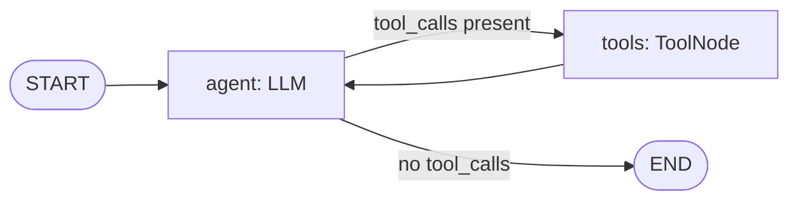

# `LangGraphAgent365/` — Explicit LangGraph `StateGraph` integrated with Microsoft Agent 365

This folder is the LangGraph sibling of [`../LangChainAgent365/`](../LangChainAgent365/). Same Agent 365 observability surface, same Azure OpenAI configuration, same `get_current_time` tool — but the agent loop is **built as an explicit `StateGraph`** with `agent` and `tools` nodes wired by a conditional edge, instead of LangChain's imperative `AgentExecutor`.

> **Why not `create_react_agent` / `create_agent`?** LangGraph (and LangChain 1.x) both ship a prebuilt one-liner that hides the graph. We deliberately do **not** use it — the point of this sample is to *show* the graph so you can see how to add parallel branches, conditional routing, human-in-the-loop interrupts, or persistent memory later. For a one-liner production agent, use `from langchain.agents import create_agent` and pass the same callback we use here.

| Concern | Same as `LangChainAgent365/`? |
|---------|-------------------------------|
| 3-hop FMI/FIC token chain | ✅ identical |
| In-memory token cache | ✅ identical |
| `import_a365_config.py` bootstrap | ✅ identical |
| **Native LangChain auto-instrumentation** | ✅ **same wiring** — LangGraph nodes are LangChain `Runnable`s, so the same instrumentor traces them |
| `A365SpanProcessor(tenant_id=..., agent_id=...)` to make spans A365-eligible | ✅ identical |
| **Agent loop** | ❌ explicit `StateGraph(agent → tools → agent → END)` instead of `AgentExecutor` |
| Invocation API | ❌ `graph.invoke({"messages": [...]})` instead of `agent_executor.invoke({"input": ...})` |

If you've already read [`../LangChainAgent365/README.md`](../LangChainAgent365/README.md), the only thing genuinely new here is the agent-loop section below.

---

## Why LangGraph? Why both?

`AgentExecutor` is fine for simple **tool-calling** agents (LLM → tool → LLM → final). LangGraph generalises this to **arbitrary state machines** with conditional edges, parallel branches, persistent memory across turns, and human-in-the-loop interrupts. The Inditex stack will likely outgrow plain `AgentExecutor` quickly — having both samples means you can pick the lowest-complexity option per use case while reusing the **same** Agent 365 bridge.

Both samples produce the **same span shape** in the Agent 365 admin center: `invoke_agent` per turn, `chat` per LLM call, `execute_tool` per tool execution — all auto-emitted by the native `LangChainInstrumentor`. The downstream consumer (Security/Compliance) cannot tell the difference.

## Layout

```text
LangGraphAgent365/
├── agent_basic.py                 # Base LangGraph agent — no telemetry
├── agent_a365.py                  # Same agent + Agent 365 instrumentation
├── observability_token_service.py # 3-hop FMI/FIC token mint
├── token_cache.py                 # In-memory bearer cache
├── import_a365_config.py          # Bridges a365.generated.config.json → .env
├── requirements.txt               # Base LangGraph stack
├── requirements-a365.txt          # + microsoft-opentelemetry + msal
├── .env.example
├── .gitignore
└── README.md                      # this file
```

## Provisioning

Same as [`../BasicAgent365/README.md` → Phase 1 (host machine)](../BasicAgent365/README.md). If you have already provisioned for `BasicAgent365/` or `LangChainAgent365/`, **reuse the same** `a365.generated.config.json` and `.env` — they are tenant- and agent-identity scoped, not stack-scoped. Just change `AGENT365_AGENT_NAME` to `inditex-langgraph-A365` in `.env` to make spans easier to filter in the admin center.

```bash
cp ../BasicAgent365/.env .
# then edit .env to set AGENT365_AGENT_NAME=inditex-langgraph-A365
```

## Install

```bash
# Base LangGraph agent only:
pip install -r requirements.txt

# With Agent 365 telemetry (also includes the base deps):
pip install --pre -r requirements-a365.txt
```

## Run it

```bash
# Base LangGraph agent (no telemetry):
az login --allow-no-subscriptions
python agent_basic.py

# Same agent + full Agent 365 telemetry:
python agent_a365.py
```

## The agent loop

LangGraph models the agent as a **state machine**. Our state is a single field:

```python
class AgentState(TypedDict):
    messages: Annotated[list[BaseMessage], add_messages]
```

And the graph has two nodes (`agent` runs the LLM, `tools` is a `ToolNode` that dispatches any tool calls in the latest assistant message) plus one conditional edge:



The equivalent in `LangChainAgent365/` is `AgentExecutor`'s opaque Python loop. LangGraph promotes that loop to a first-class graph object you can extend with conditional routing, branches, memory checkpoints, etc.

Both produce the **same event sequence** under the hood (`Runnable.invoke` → `ChatModel.invoke` → optionally `Tool.invoke` → repeat), which is why the same native `LangChainInstrumentor` traces both folders unchanged.

The invocation API is slightly different:

```python
# LangChain AgentExecutor:
result = agent_executor.invoke({"input": user_input})    # plain string input
final = result["output"]

# LangGraph StateGraph:
state = agent.invoke({"messages": [HumanMessage(content=user_input)]})
final = state["messages"][-1].content
```

## Anchors

Same convention as the other folders — every Agent 365-specific line is prefixed with `# [A365] ...`:

```bash
grep -n "# \[A365\]" agent_a365.py
```

## Expected output

```
INFO agent_a365: Acquiring Agent 365 observability token via 3-hop FMI chain...
INFO agent_a365: Observability token cached successfully.
==================================================
LANGGRAPH AGENT — Agent 365 integrated
==================================================
You: What time is it in Madrid?

Agent: It's 16:14 (4:14 PM) in Madrid right now.
```

The same `tenant_not_licensed` caveat from the other samples applies — see [`../BasicAgent365/docs/INTEGRATION_GUIDE.md` § 15](../BasicAgent365/docs/INTEGRATION_GUIDE.md).

## Next steps

- [`../BasicAgent365/`](../BasicAgent365/) — the no-framework reference implementation (raw OpenAI Responses API). Read this first if you want the minimum-viable Agent 365 wire-up.
- [`../LangChainAgent365/`](../LangChainAgent365/) — same A365 wiring, but driven by LangChain's `AgentExecutor`. See its README for the in-depth description of the auto-instrumentation + `A365SpanProcessor` pattern (identical here).
- [`../BasicAgent365/docs/INTEGRATION_GUIDE.md`](../BasicAgent365/docs/INTEGRATION_GUIDE.md) — the long-form rationale: threat model, FMI identity model, three-hop token chain, gotchas.
